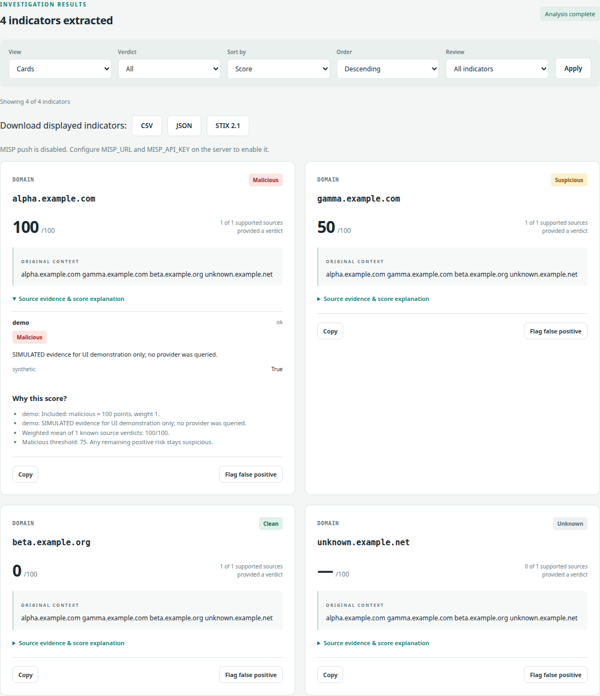
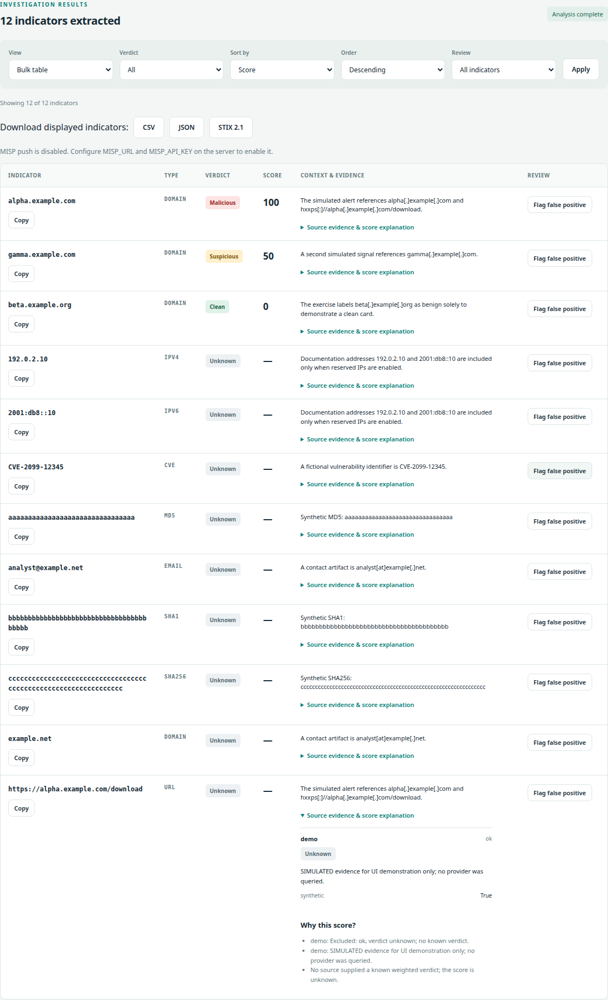
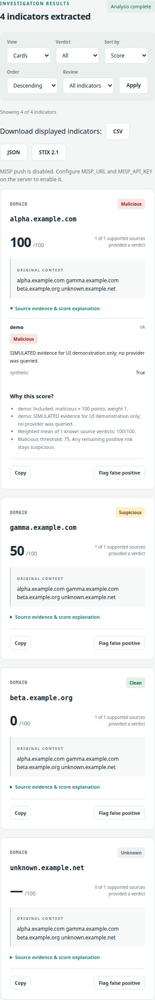

# IOCDesk — IOC Extractor & Enricher

[](https://github.com/yohanesderese/ioc-extractor-enricher/actions/workflows/ci.yml)

A local workspace for SOC and CTI analysts: extract and normalize indicators,
inspect source evidence, understand the score, and export an investigation.
Extraction works offline; enrichment is an explicit choice.

- Nine IOC types with defanging support, validation, deduplication and context.
- Eight intelligence sources with async queues, timeouts and a SQLite evidence cache.
- Explainable verdict cards, a sortable bulk table, and analyst false-positive flags.
- CSV, JSON and STIX 2.1 downloads; optional confirmed MISP event creation.

Inputs currently support pasted text, UTF-8 text files and URL **indicators**.
PDF/HTML report parsing and fetching report pages from URLs are not implemented.
Reports are temporary, session-scoped and designed for one local server worker.

## Screenshots

These screenshots use **simulated evidence** from the offline demo. They make no
reputation claims about the example indicators and require no API keys.





<details>
<summary>Mobile view</summary>



</details>

## Setup

Requires Python 3.11 or newer.

```bash
python3 -m venv .venv
source .venv/bin/activate
python -m pip install -e '.[dev]'
```

`tldextract` validates domains against its bundled public suffix snapshot without
network requests. `httpx` handles asynchronous enrichment HTTP requests. `pytest`
and `ruff` are development tools. `stix2` constructs and validates STIX 2.1 objects.
No API keys are needed for extraction.

The web app uses FastAPI for endpoints, Jinja2 for server-rendered pages,
`python-multipart` for text uploads, and Uvicorn for the local server. HTMX 2.0.11
is bundled with its license and served locally; no CDN is needed at runtime.

## Offline examples and demo

```bash
ioc-extract --text 'Seen hxxps://Example[.]com/demo'
ioc-extract --file examples/synthetic-report.txt --include-reserved-ips
python examples/demo.py --serve
```

The first command returns a URL `https://example.com/demo` and its domain
`example.com`. The sample file exercises all nine types. Its documentation IPs
are intentionally excluded unless `--include-reserved-ips` is supplied.

For the demo, open `http://127.0.0.1:8001` and paste:

```text
alpha.example.com gamma.example.com beta.example.org unknown.example.net
```

Select enrichment to display **fabricated** malicious, suspicious, clean and
unknown verdicts from the local `demo` source. The demo injects a simulated engine;
it makes no provider or MISP requests, even if real keys exist in the environment.
For the all-types table, upload `examples/synthetic-report.txt` and enable
**Include private and reserved IPs**. Extraction options are under the disclosure.

[Example inputs and exports](examples/README.md) include CSV, JSON and a validated
STIX 2.1 bundle, generated by:

```bash
python examples/demo.py --export-dir /tmp/iocdesk-examples
```

The sample hashes and CVE identifier are fabricated; all demo evidence is clearly
marked `SIMULATED`. Keep enrichment unchecked when loading the fixture in the
regular app, which uses real providers.

## Docker quick start

Requires Docker Engine and Compose v2. No keys are required for offline extraction.

```bash
docker compose --env-file /dev/null up --build --detach --wait
```

Open `http://127.0.0.1:8000`. The port is bound to localhost. To change it, export
`IOCDESK_PORT=8002` before running Compose. The runtime image installs the packaged
application, runs as UID/GID 10001, and uses a read-only root filesystem with a
small temporary mount. `/data` is a writable named volume; the default SQLite
cache is `/data/enrichment.db`. One Uvicorn worker preserves session ownership.

To enable providers or MISP, export the variables listed in `.env.example` in your
shell and recreate the service with the same command. Compose passes those named
variables into the container; credentials are never build arguments or image
contents. `--env-file /dev/null` disables implicit `.env` loading; the application
itself reads only process environment variables. Avoid sharing rendered Compose
configuration because it can include supplied credentials. See
[Docker's environment-variable documentation](https://docs.docker.com/compose/how-tos/environment-variables/variable-interpolation).

To use the offline CLI in the running container:

```bash
printf '%s\n' 'Seen example[.]com' | docker compose --env-file /dev/null exec -T workspace ioc-extract
```

Stop the workspace while keeping the evidence cache:

```bash
docker compose --env-file /dev/null down
```

Reports, review flags and MISP push outcomes still disappear when the process
stops; only evidence caching persists. The health check requests `/openapi.json`
without running provider lookups. The build context contains package inputs only,
excluding local credentials, databases, virtual environments, fixtures and screenshots.
Dependency versions are bounded in `pyproject.toml`; builds currently resolve
those ranges rather than a lockfile. This image is for local use, not a public
multi-user deployment.

## Web workspace

```bash
uvicorn ioc_extractor_enricher.app:app --host 127.0.0.1 --port 8000
```

Open `http://127.0.0.1:8000`. Paste text, upload a UTF-8 text file, or enter a URL
indicator. Inputs may be combined. PDF/binary parsing and fetching report pages
from URLs are not implemented; URL input analyzes the URL itself. Limits are
1 MiB combined text and 50 unique indicators per report.

Extraction runs locally by default. Select **Enrich with configured threat
sources** to send extracted values to providers using the environment keys
described below. Results appear immediately and poll while queued lookups run;
the report job stops after five minutes, retaining completed cards and marking
unfinished cards unknown with a timeout reason. A failed source cannot become a
clean verdict. Keyed sources are disabled without their keys; InternetDB and RDAP
work without keys when enrichment is selected.

Cards show the original context, source status and selected facts, report links,
copy controls, and the score calculation. Switch to the bulk table and filter by
verdict or review state; sort by score, value, or type. Unknown scores always sort
after known scores. False-positive flags are reversible analyst annotations:
they preserve provider evidence and the calculated score.

Reports and review flags stay in process memory, expire after one hour, and are
lost on restart. Evidence caching remains in SQLite. This milestone is for a
single local server/worker, with up to 32 reports and 64 browser sessions; there
is no login system or persistent investigation history. Browser session cookies
scope reports, and mutations require CSRF tokens. Serve on localhost for local
use. Public hosting and shared analyst access need a separate authentication and
persistence design.

The app factory supports injected engines, custom cache paths and optional
whitelist files: `create_app(engine=None, cache_path="enrichment.db",
whitelist_path=Path("config/whitelist.txt"))`. The default whitelist is empty.
Provider keys are loaded at startup, so restart after changing the environment.

### Score policy

Default weights are VirusTotal 5, AbuseIPDB 3, OTX 2, URLhaus 5, MalwareBazaar 5,
GreyNoise 2, InternetDB 1 and RDAP 1. Custom sources default
to weight 1. Known verdict points are malicious 100, suspicious 50, and clean 0.
The score is the rounded weighted mean of known `ok` verdicts only. Unknown or
unavailable sources do not contribute to the denominator; source coverage is
shown alongside the score.

A score of at least 75 is malicious. Any remaining positive source risk stays
suspicious, even if a small contribution rounds to zero. A clean result requires
known clean evidence without positive risk. With no eligible evidence, the score
is `null` and the label is unknown (displayed as `—` in the UI). These are
transparent project heuristics, not calibrated probabilities of compromise.
`score_results(results, weights={"otx": 1})` overrides source weights; zero excludes
a source. Reasons include every source's contribution/exclusion and evidence.

### JSON API

Start a session with `GET /` and retain its `ioc_session` cookie. Read the hidden
form `csrf` value and send it as `X-CSRF-Token` for mutations.

| Method | Endpoint | Purpose |
| --- | --- | --- |
| POST | `/api/analyze` | Create a report from `text`, `url`, and extraction options; `enrich` defaults to false |
| GET | `/api/reports/{id}` | Poll evidence, assessment, pending state, and review flags |
| POST | `/api/reports/{id}/cards/{card_id}/false-positive` | Set `{"false_positive": true}` or false |
| GET | `/reports/{id}/export/{format}` | Download `csv`, `json`, or `stix`; supports verdict/review/sort/order filters |
| POST | `/api/reports/{id}/misp` | Explicit push with `{"confirm": true}` and CSRF token |
| GET | `/openapi.json` | API schema |

Analysis returns HTTP 202 with the report ID, `pending`, and `cards`. Each card
contains its IOC, evidence, assessment, and analyst annotation. HTML routes use
the same reports and return fragments when `HX-Request: true`. Standalone Swagger
and ReDoc pages are disabled to keep browser assets local.

## Usage

```bash
ioc-extract --text 'Seen hxxps://Example[.]com/path and user[at]example.org'
ioc-extract --file report.txt
printf '%s\n' '8.8.8.8' | ioc-extract
ioc-extract --file report.txt --whitelist config/whitelist.txt
```

Output is a JSON array containing `type`, normalized `value`, and the first
original context sentence. Supported types: IPv4, IPv6, domain, HTTP(S) URL, MD5,
SHA1, SHA256, email, and CVE. URL and email domains are emitted as extra IOCs;
URL IP hosts are also emitted as address IOCs.

Common defanging forms such as `hxxp`, `[.]`, `(.)`, `[:]`, `[at]`, and `\.` are
restored before validation. Reserved/private IPs and all-zero hashes are excluded
by default. Use `--include-reserved-ips` or `--include-zero-hashes` to include them.

Whitelists contain one benign domain or IP per line, with optional `#` comments.
Domains match themselves and their subdomains, including URL and email hosts.
Filtering is enabled when a whitelist is supplied; `--no-noise-filter` disables
it. The sample whitelist starts empty.

```python
from ioc_extractor_enricher import extract

for ioc in extract("Seen example[.]com in a synthetic report."):
    print(ioc.type, ioc.value, ioc.context)
```

## Validation and CI

GitHub Actions runs Ruff and the mocked test suite on Python 3.11, 3.12 and 3.13
for pull requests, main and feature branches. It also builds/installs a wheel,
checks packaged assets and CLI extraction, builds the Docker image, and verifies
web startup and cache creation. No provider keys or MISP secrets are needed.
The workflow uses read-only repository permissions and does not publish images
or deploy the app. See [GitHub's Python CI guide](https://docs.github.com/en/actions/tutorials/build-and-test-code/python).

Run the same core checks locally:

```bash
ruff check .
pytest -q
python scripts/check_package.py
```

Tests use synthetic data and make no API calls. Extraction identifies syntactically
valid candidates, not maliciousness. Context uses punctuation/line boundaries,
so abbreviations can split sentences. ASCII DNS names and HTTP(S) URLs are
supported. PDF/HTML parsing, URL fetching, Unicode domain conversion and live
public suffix updates are not implemented.

## Enrichment

The enrichment API is a Python library; `ioc-extract` remains offline. Configure
the source keys in your process environment before constructing adapters:

| Source | Environment variable | Supported IOC types |
| --- | --- | --- |
| VirusTotal | `VT_API_KEY` | IPv4, IPv6, domain, URL, MD5, SHA1, SHA256 |
| AbuseIPDB | `ABUSEIPDB_API_KEY` | IPv4, IPv6 |
| AlienVault OTX | `OTX_API_KEY` | IPv4, IPv6, domain, URL, hashes, CVE |
| URLhaus | `ABUSECH_AUTH_KEY` | URL, domain, IPv4 |
| MalwareBazaar | `ABUSECH_AUTH_KEY` | MD5, SHA1, SHA256 |
| Shodan InternetDB | None | IPv4 |
| GreyNoise Community | `GREYNOISE_API_KEY` | IPv4 |
| Registry RDAP | None | Domain (registrable parent) |

`.env.example` documents the names. The library does not open `.env` files; your
launcher can supply their values as environment variables. Missing, empty, or
example-placeholder keys disable that source without making an HTTP request.
Keys are sent in provider authentication headers, not URLs, and redirects are
disabled. Request/response bodies and exception messages are not logged or cached.

```python
import asyncio
from dataclasses import asdict

import httpx

from ioc_extractor_enricher import extract
from ioc_extractor_enricher.cache import SQLiteCache
from ioc_extractor_enricher.enrichment import (
    AbuseIPDB,
    EnrichmentEngine,
    OTX,
    VirusTotal,
)


async def main() -> None:
    iocs = extract("Synthetic example: example[.]com")
    async with httpx.AsyncClient() as client, SQLiteCache("enrichment.db") as cache:
        engine = EnrichmentEngine(
            [VirusTotal(client), AbuseIPDB(client), OTX(client)],
            cache,
        )
        for ioc, evidence in zip(iocs, await engine.enrich_many(iocs)):
            print(ioc.value, [asdict(result) for result in evidence])


asyncio.run(main())
```

Enrichment sends indicator values to the configured providers; context sentences
remain local. VirusTotal documents that queried indicators may enter its public
dataset. Use public or synthetic indicators for demos.

Each result contains `source`, `status`, `verdict`, `reasons`, selected `facts`,
a provider `link`, `observed_at` (Unix timestamp), and `cached`. Status values are
`ok`, `not_found`, `disabled`, `unsupported`, `timeout`, `rate_limited`, and `error`.
Failures retain an `unknown` verdict and do not erase other source results.

Source verdicts are evidence mappings, not the final weighted score:

- VirusTotal: malicious detections take precedence over suspicious detections;
  positive harmless detections yield clean. Only undetected results yield unknown.
- AbuseIPDB: confidence of at least 75 yields malicious; lower positive confidence
  or report counts yield suspicious. No reports yield unknown. Reports use a
  90-day window.
- OTX: positive pulse references yield suspicious and require analyst review;
  no pulse references yield unknown.

SQLite entries are keyed by source, normalized IOC type, and value. Defaults are
1 hour for IPs, URLs, and email; 6 hours for domains; 24 hours for hashes and CVEs.
Override with `SQLiteCache(path, ttls={"domain": 3600})`; a TTL of zero disables
caching for that type. Only `ok` and `not_found` results are cached. Expired or
corrupt entries become misses, and SQLite operation failures allow uncached
lookups. The caller owns the cache and HTTP client lifetimes.

Each engine queues requests FIFO per source, while different sources run
concurrently. Requests start at least 15 seconds apart for VirusTotal and 1 second
apart for AbuseIPDB/OTX/URLhaus/MalwareBazaar/InternetDB/RDAP and 5 seconds
apart for GreyNoise by default. Override seconds with
`EnrichmentEngine(plugins, cache, intervals={"otx": 2})`. Cache hits skip request
slots, and simultaneous identical requests share cached evidence. These limits
apply to one engine/process; they do not coordinate across processes or account
for calls made by other applications, and do not enforce daily account quotas.

HTTP 429 responses return immediately as `rate_limited`, with subsequent requests
delayed by `Retry-After` (seconds or HTTP date), or at least 60 seconds when it is
absent/invalid. There are no automatic retries. Lookup timeouts default to 10
seconds and exclude time spent waiting in the source queue. Configure the engine
and individual adapter `timeout` arguments as needed. Cancelling a batch releases
its queued requests.

Provider tests use `httpx.MockTransport`, synthetic environment keys, and a guard
against live HTTP. Queue timing and TTL tests use controlled clocks. Provider
accounts and live authentication have not been exercised by these tests.

API references: [VirusTotal v3 reports](https://docs.virustotal.com/reference/ip-info),
[VirusTotal URL identifiers](https://docs.virustotal.com/reference/url-info),
[AbuseIPDB check](https://docs.abuseipdb.com/#check-endpoint), and the
[official OTX Python SDK](https://github.com/AlienVault-OTX/OTX-Python-SDK).

## Additional sources and integrations

[URLhaus](https://urlhaus-api.abuse.ch/) and
[MalwareBazaar](https://bazaar.abuse.ch/api/) use a free abuse.ch Auth-Key for
form-based lookups. URLhaus malware-download URL records are malicious evidence,
including historical offline records; host associations are suspicious context.
A matching MalwareBazaar sample hash is malicious evidence. Neither adapter
uploads reports or retrieves malware samples. Community use follows the providers'
fair-use limits; no paid endpoints or subscriptions are invoked.

[InternetDB](https://book.shodan.io/developer-apis/internetdb/) uses the no-key
API. Open ports alone remain unknown; reported potential vulnerabilities are
suspicious exposure context, not proof of compromise.
[GreyNoise Community](https://docs.greynoise.io/docs/using-the-greynoise-community-api)
requires an eligible account key. The documented free business-email tier offers
up to 50 lookups/week; free-email accounts do not have API-key access. Without a
key the adapter stays disabled. Malicious/benign classifications map to
malicious/clean; unknown scanners are suspicious and RIOT membership alone
remains unknown. Request spacing does not enforce weekly quotas.

RDAP uses the bundled [IANA DNS bootstrap](https://data.iana.org/rdap/dns.json)
snapshot to select HTTPS registry endpoints, with no registrar redirects or WHOIS
subprocess. Subdomains use their registrable parent's registration events. Age
under 30 days is suspicious context; older, missing or future dates remain
unknown. The snapshot is packaged for offline routing and does not auto-update;
registries without a supported HTTPS service return an unavailable result.

After enrichment completes, use the download buttons for the **displayed**
indicators, respecting filters and sorting. JSON includes full context, evidence,
score explanations and false-positive annotations. CSV has one row per IOC and
neutralizes spreadsheet formula prefixes; use JSON for lossless text. STIX 2.1
contains observables (or CVE Vulnerability objects) and evidence Notes. Only
unflagged suspicious/malicious non-CVE findings also become Indicators. Clean,
unknown and flagged findings stay observations, without detection patterns.
STIX/JSON include original context sentences, so review the export before sharing.

For MISP, supply `MISP_URL` (HTTPS, optionally a base path) and `MISP_API_KEY` in
the server environment and restart. The key stays in an Authorization header;
TLS verification is enabled and redirects are disabled. The UI requires explicit
confirmation to send **all unflagged indicators in the report**, regardless of
display filters. It creates an unpublished organization-only event with indicator
values and score summaries, without original sentences or full source evidence.
Only malicious non-CVE attributes have `to_ids=true`; other attributes explicitly
use false. See the [MISP API](https://www.misp-project.org/documentation/openapi.html).

One push attempt is retained per report, including uncertain outcomes. Double
clicks and retries reuse the outcome rather than creating another event. A timeout
or malformed response can follow a successful remote write: check MISP before
sending a new report. Event UUIDs are stable per report, but restarting loses
local reports/attempts; this is not durable cross-process deduplication. Later
local review changes do not modify an already sent event. Authentication and live
MISP servers are not exercised by tests; all transport tests use mocks.

## Milestones

- M1: extraction, refanging, validation, noise filtering, tests and CLI.
- M2: enrichment plugins, cache and rate limiting.
- M3: explainable scoring, FastAPI and HTMX UI.
- M4: additional sources, CSV/JSON/STIX export and optional MISP push.
- M5: usage examples, screenshots, synthetic sample reports, Docker and CI.
